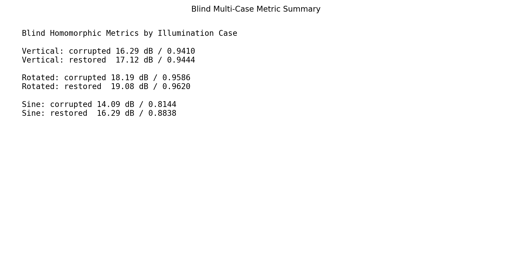
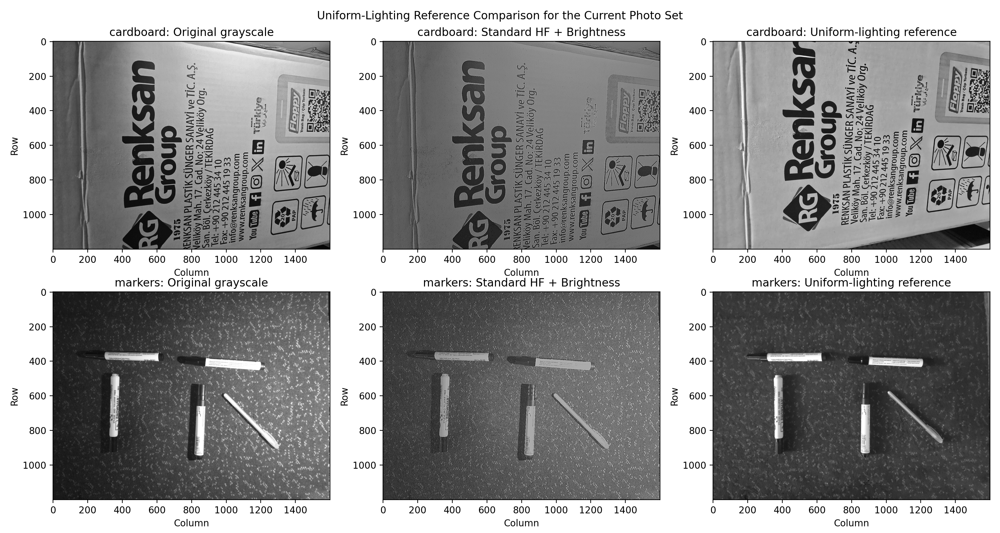
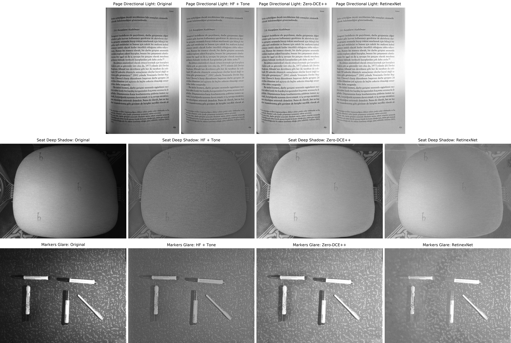
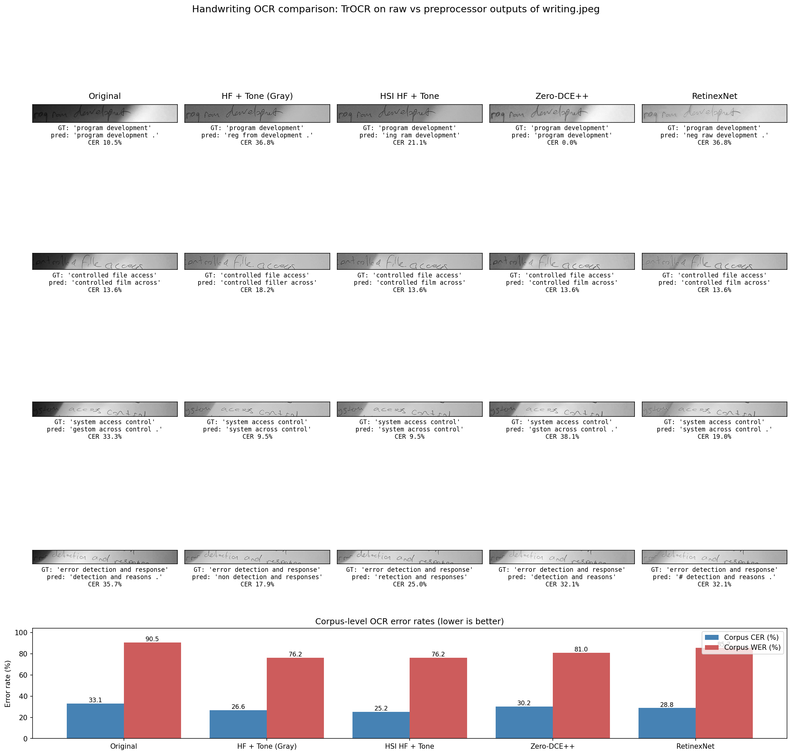
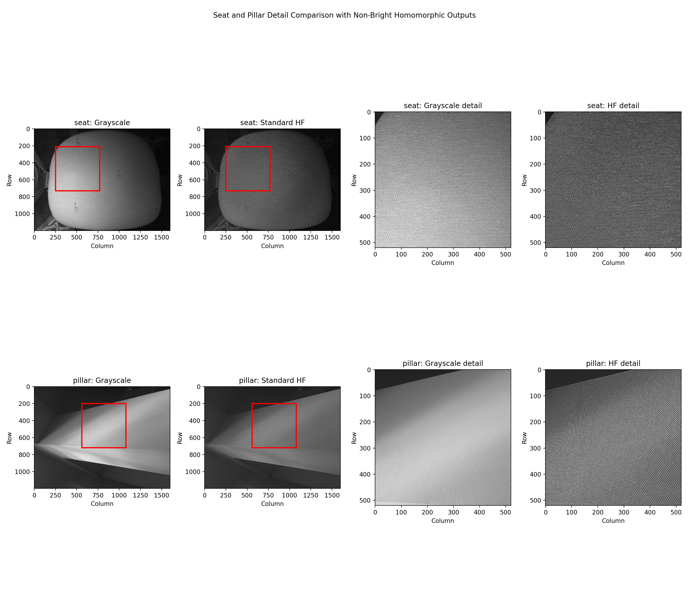
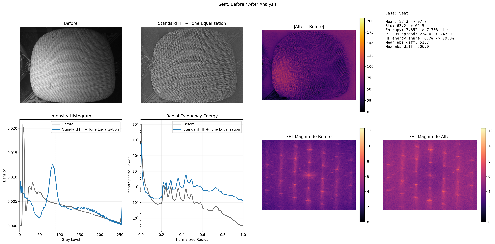
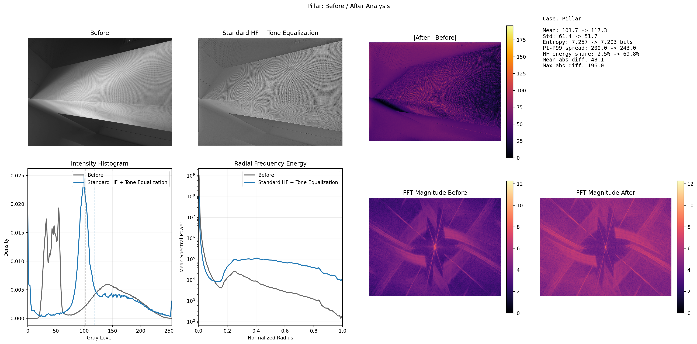
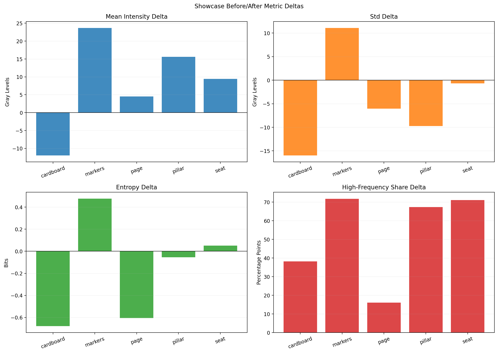
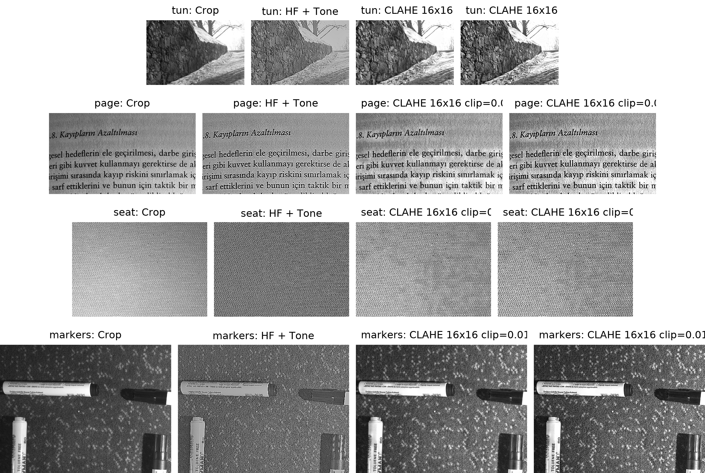

# Homomorphic Filtering for Non-Uniform Illumination Correction

**Course:** ELE490 - Fundamentals of Image Processing  
**Project:** Bonus Project  
**Student:** [Your Name]  
**Date:** May 2026  
**Draft status:** First complete report draft

## Abstract

Non-uniform illumination is a common problem in practical images. A document
photographed under a flashlight, an object partly covered by shadow, or a scene
captured under directional lighting may contain useful detail, but the slow
variation in brightness makes that detail difficult to inspect. This project
studies homomorphic filtering as a classical image-processing method for this
problem. The method is based on the illumination-reflectance model, where an
image is treated as the product of a slowly varying illumination component and a
faster reflectance/detail component. By applying a logarithm, filtering in the
frequency domain, and then transforming back, the algorithm can suppress
low-frequency illumination while preserving or enhancing higher-frequency
structure.

The project implements a complete grayscale homomorphic filtering pipeline,
validates it on synthetic uneven-illumination images with PSNR and SSIM, and
then tests it on real photographs with visible shadows and directional lighting.
The final report-facing pipeline uses Gaussian homomorphic filtering followed
by a brightness lift and a controlled tone-equalization step. A more
conservative setting is used for the page/document example to avoid
over-processing paper texture. The project also includes comparisons against
histogram equalization, CLAHE/AHE, Zero-DCE++, RetinexNet, and Sauvola
binarization for OCR. An HSI color extension processes only the intensity
channel so hue and saturation are preserved.

The strongest controlled result is on synthetic illumination patterns, where
the homomorphic baseline reaches average PSNR `17.889 dB` and SSIM `0.9380`,
outperforming the tested CLAHE and pretrained CNN baselines on SSIM. Real-image
figures show the method is most useful when the main degradation is broad,
low-frequency illumination variation, especially for document/readability
examples. A downstream handwriting OCR test further supports this scope: on the
severe `writing.jpeg` bad-scan sample, corpus CER improves from `34.5 %` for
the original image to `20.9 %` with HF + Tone and `20.1 %` with Sauvola. On the
cleaner Bentham historical line crops, however, preprocessing is not
universally beneficial. Detail-comparison figures also show that the accepted
filter can preserve visible material texture and handwriting structure while
flattening broad illumination, which is why the report treats detail behavior
as a separate quality criterion. The final conclusion is therefore deliberately
bounded: homomorphic filtering is a strong classical baseline for targeted
uneven-illumination correction, but it is not a universal image enhancement or
OCR preprocessing method.

## Table of Contents

1. [Introduction](#1-introduction)  
2. [Theoretical Background](#2-theoretical-background)  
3. [Methodology](#3-methodology)  
4. [Experimental Setup](#4-experimental-setup)  
5. [Results](#5-results)  
6. [Discussion](#6-discussion)  
7. [Limitations](#7-limitations)  
8. [Conclusion](#8-conclusion)  
9. [Appendix A: Extra Experiment Notes](#appendix-a-extra-experiment-notes)  
10. [Appendix B: Reproduction Notes](#appendix-b-reproduction-notes)  
11. [References](#references)

## 1. Introduction

Images captured outside controlled laboratory conditions often suffer from
non-uniform illumination. The same object or page may contain both dark shadow
regions and bright highlighted regions. When the intensity variation is strong,
the visual content can become difficult to inspect even if the camera captured
the underlying detail. This is especially important in document images: a page
or handwritten note photographed under directional lighting may be readable in
one region and almost invisible in another. The problem is not simply that the
image is globally too dark or too bright. The problem is spatially varying
illumination.

A simple global brightness correction cannot solve this type of degradation. If
the whole image is brightened, highlight regions can become washed out. If the
whole image is darkened, shadow regions remain unreadable. Histogram
equalization can increase contrast, but it often changes the image in a harsh
way and can amplify texture or noise. Local contrast methods such as CLAHE can
make text strokes sharper, but they can also exaggerate paper grain, fabric
texture, and background irregularities. The goal of this project is not to make
every image "more contrasty." The goal is more specific: reduce broad
illumination variation while keeping useful image detail.

Homomorphic filtering is a natural classical method for this task because it
models an image as a product of illumination and reflectance. Illumination is
usually assumed to vary slowly across the image, while reflectance corresponds
more closely to edges, strokes, material detail, and object boundaries. A
frequency-domain filter can therefore reduce low-frequency illumination
components and preserve or moderately boost higher-frequency reflectance
components. This project implements that idea and evaluates how far it can go
on both controlled and real images.

The project has four main goals:

1. Implement a clear and reproducible homomorphic filtering pipeline.
2. Validate the method quantitatively on synthetic images where controlled
   corruption is available.
3. Test the method on real uneven-lighting images and compare it with simpler
   and learned alternatives.
4. Evaluate a practical downstream use case, handwriting OCR/readability,
   while avoiding overclaiming.

The final result is a script-based image-processing project with reproducible
outputs, accepted and rejected experiment branches, and a narrowed reporting
story. The strongest reportable claim is that homomorphic filtering is useful
for low-frequency illumination correction, especially in document/readability
contexts. The project also shows where the method does not help: it is not
always beneficial on already-legible images, and it can overemphasize fine
texture if the parameters are too aggressive.

## 2. Theoretical Background

### 2.1 Illumination-Reflectance Image Model

The starting point for homomorphic filtering is the common image formation
model:

```text
f(x, y) = i(x, y) r(x, y)
```

Here `f(x, y)` is the observed image intensity, `i(x, y)` is the illumination
component, and `r(x, y)` is the reflectance component. Illumination describes
how much light reaches the scene or surface. Reflectance describes how the
surface itself reflects light and therefore contains much of the structural
detail we want to preserve.

The difficulty is that illumination and reflectance are multiplied together.
Frequency-domain filtering is easier when components are additive, so the
algorithm first applies a logarithmic transform:

```text
ln(f(x, y)) = ln(i(x, y)) + ln(r(x, y))
```

After this transform, illumination and reflectance are represented as an
additive mixture. The image can then be transformed into the Fourier domain,
filtered, and transformed back.

### 2.2 Frequency-Domain Interpretation

The central assumption is that illumination varies slowly across the image.
Slow spatial variation corresponds to low spatial frequencies. Reflectance,
edges, handwriting strokes, and local detail change more quickly, so they tend
to contribute more energy at higher spatial frequencies. Homomorphic filtering
uses this separation to reduce low-frequency content and retain higher
frequency content.

The project implements both Butterworth and Gaussian homomorphic filter
families, but the accepted real-scene showcase uses the Gaussian version. The
Gaussian high-pass style component is:

```text
H_hp(u, v) = 1 - exp(-D(u, v)^2 / (2 D0^2))
```

where `D(u, v)` is the distance from the frequency origin and `D0` controls
the transition scale. The full homomorphic filter is:

```text
H(u, v) = (gamma_H - gamma_L) H_hp(u, v) + gamma_L
```

The parameter `gamma_L` controls the gain applied to low-frequency
illumination. A value below 1 suppresses broad illumination. The parameter
`gamma_H` controls the gain applied to high frequencies. A value near 1
preserves high-frequency detail without aggressive sharpening. The parameter
`D0` controls how much of the frequency spectrum is treated as low-frequency
illumination.

### 2.3 Processing Steps

The core grayscale processing pipeline is:

1. Convert the input image to grayscale if needed.
2. Normalize intensity to `[0, 1]`.
3. Apply `log1p` to convert multiplicative structure into additive structure.
4. Apply the 2D Fourier transform.
5. Multiply the centered spectrum by the homomorphic filter.
6. Apply the inverse Fourier transform.
7. Apply the exponential inverse transform.
8. Normalize the result to `uint8` for display and evaluation.

This core pipeline corrects illumination but can produce a result that is still
visually dim in a side-by-side report figure. For that reason, the final
showcase pipeline includes a gentle brightness lift and a tone-equalization
step. These are presentation-oriented stages, not replacements for the
homomorphic filtering itself.

## 3. Methodology

### 3.1 Accepted Grayscale Pipeline

The accepted report-facing grayscale pipeline is:

```text
RGB input if needed
  -> grayscale
  -> Gaussian homomorphic filtering
  -> brightness lift
  -> tone equalization
  -> final report image
```

The global real-scene setting is:

| Parameter | Value |
| --- | --- |
| Filter family | Gaussian |
| `gamma_L` | `0.06` |
| `gamma_H` | `1.00` |
| `D0` | `320` |
| Brightness gamma | `0.72` |

This setting was selected after real-scene tuning, especially on the tunnel and
hard-case image set. It strongly suppresses broad illumination variation while
keeping high frequencies close to their original scale. The choice
`gamma_H = 1.00` is important: the goal is not to produce an aggressively
sharpened image, but to reduce slow lighting variation.

### 3.2 Page-Specific Document Setting

The page/document example uses a more conservative setting:

| Parameter | Value |
| --- | --- |
| Filter family | Gaussian |
| `gamma_L` | `0.25` |
| `gamma_H` | `1.00` |
| `D0` | `160` |
| Brightness gamma | `0.84` |

The reason for a separate document setting is that paper texture is delicate.
The global setting can make background texture and local noise too visible on a
page. The conservative page setting preserves the readability improvement while
reducing the risk of harsh paper artifacts.

### 3.3 Tone Equalization Stage

The tone-equalization stage estimates a smoothed base image and applies
controlled shadow and highlight adjustments. Dark broad regions are lifted and
bright broad regions are slightly restrained. This is designed as a display
stage after homomorphic filtering. It makes report figures easier to interpret
while keeping the main correction mechanism grounded in the frequency-domain
homomorphic step.

### 3.4 HSI Color Extension

The original pipeline is grayscale. For color images, directly applying
correction to each RGB channel can cause unnatural hue shifts. The project
therefore adds an HSI extension:

1. Convert RGB to HSI.
2. Apply the accepted grayscale pipeline only to the intensity channel.
3. Preserve hue and saturation.
4. Recombine the processed intensity with the original hue and saturation.

This design treats uneven lighting as primarily an intensity problem. It is
also easy to explain in a report: the color structure is not artificially
changed, but the brightness field is corrected.

### 3.5 Compared Methods

The project compares the accepted pipeline against several alternatives:

- **Histogram equalization (HEQ):** a simple global contrast method.
- **CLAHE/AHE:** local contrast methods often used for document and medical
  images.
- **Zero-DCE++:** a pretrained low-light enhancement network.
- **RetinexNet:** a pretrained Retinex-inspired low-light enhancement network.
- **Sauvola binarization:** a classical local thresholding method used as an
  OCR/document baseline.

Some alternatives are included as final comparisons, while others are
documented as rejected experiments. This distinction matters. The report should
not imply that every method improved the result. A useful part of the project
is that several plausible methods were tested and rejected for clear reasons.

### 3.6 Detail-Preservation Inspection

The project also includes close-up detail comparisons and before/after
analysis panels. This is important because the desired result is not simply a
high-contrast image. A good illumination-correction result should reduce the
slow lighting field while retaining useful reflectance detail such as text
strokes, fabric weave, paper texture, marker edges, and object boundaries.

The analysis figures use simple proxy measurements: mean intensity, standard
deviation, entropy, high-frequency energy share, and mean absolute difference.
These metrics are not ground-truth restoration scores for the real images.
They are used as diagnostic evidence: if a method visibly flattens illumination
but destroys small structure, or if it mostly amplifies texture/noise without
fixing the lighting field, the close-up crops and proxy metrics make that
failure easier to identify.

## 4. Experimental Setup

### 4.1 Synthetic Validation

The synthetic experiments are the cleanest quantitative validation because the
corruption is controlled. The project generated several uneven-illumination
patterns from a base image, including vertical, rotated, sinusoidal, and
uneven patterns. The restored outputs were compared against the clean reference
using MSE, PSNR, and SSIM.

Synthetic validation is important because real photographs do not have exact
ground truth. In real images, we can judge visual improvement and downstream
task behavior, but we cannot compute true restoration error. The synthetic
stage gives the project an objective foundation before moving to real images.

### 4.2 Real-Image Showcase

The active real-image showcase focuses on:

- `cardboard`
- `markers`
- `page`
- `pillar`
- `seat`

The `cardboard` and `markers` examples also have more evenly illuminated
reference captures. These references are used only as visual aids. They are not
treated as pixel-perfect ground truth because the camera position, local
surface response, and capture conditions are not guaranteed to match exactly.

The `page` example is the strongest practical document-readability case. It is
important because it connects the method to a real use case: improving a page
or document photographed under uneven lighting.

The real-image analysis also includes detail crops for `seat`, `pillar`, and
`page`. These were kept because they show a different part of the result than
the full-frame overviews. The overviews show whether illumination becomes more
even; the crops show whether texture, edges, and fine structure survive the
correction.

### 4.3 Learned Baseline Comparison

The project includes two pretrained learned baselines:

- Zero-DCE++
- RetinexNet

These models are useful because they represent modern enhancement approaches.
However, they are not perfect like-for-like comparisons. Their pretrained
weights are associated with low-light enhancement distributions, while this
project targets non-uniform illumination and shadow correction. For that
reason, the report uses them as comparison baselines, not as proof that one
method is universally better than the other.

### 4.4 OCR Downstream Task

The final practical task is handwriting OCR/readability. The benchmark uses
TrOCR `microsoft/trocr-large-handwritten` and scores predictions using corpus
character error rate (CER) and word error rate (WER).

Two handwriting sources are used:

1. `writing.jpeg`: 8 manually transcribed lines from a severe bad-scan image
   with flashlight beam, dark shadow, and yellow color cast.
2. Bentham R0: 30 deterministic historical handwriting line crops sampled from
   the public Bentham dataset.

The OCR comparison includes:

- Original
- HF + Tone (Gray)
- HSI HF + Tone
- Sauvola
- Zero-DCE++
- RetinexNet

This benchmark is intentionally interpreted carefully. The `writing.jpeg`
sample matches the project target: uneven illumination makes handwriting hard
to read. Bentham is a useful public historical handwriting dataset, but its
line crops are already much cleaner than the bad-scan phone image. Therefore,
the OCR section is not used to claim universal OCR improvement. It is used to
show where the preprocessing helps and where it does not.

## 5. Results

### 5.1 Synthetic Quantitative Results

The synthetic method table provides the clearest numerical comparison. The
homomorphic synthetic baseline achieves the strongest average SSIM among the
tested methods:

| Method | Avg MSE | Avg PSNR | Avg SSIM | Avg Runtime (ms) |
| --- | ---: | ---: | ---: | ---: |
| Homomorphic Synthetic Baseline | `1100.199` | `17.889` | `0.9380` | `69.96` |
| CLAHE 16x16 clip=0.01 | `1597.519` | `16.150` | `0.8655` | `132.13` |
| CLAHE 16x16 clip=0.01 + High Boost | `1807.681` | `15.605` | `0.7823` | `64.74` |
| Zero-DCE++ | `1878.978` | `15.546` | `0.8665` | `13.78` |
| RetinexNet | `3936.978` | `12.181` | `0.7624` | `317.98` |

The homomorphic baseline is not the fastest method. Zero-DCE++ is faster in
this table. But the homomorphic baseline gives the best synthetic
reconstruction quality by both PSNR and SSIM. This supports the idea that the
classical method is well matched to the controlled non-uniform illumination
problem.

The broader synthetic validation also showed improvement from about
`13.35 dB / 0.8280 SSIM` on the corrupted image to about
`17.89 dB / 0.9019 SSIM` on a restored synthetic case. The exact table above
uses the later multi-pattern synthetic comparison and is the stronger final
quantitative reference.



**Figure 1.** Synthetic metric summary used as controlled validation evidence.
The synthetic setup is the closest part of the project to true ground-truth
evaluation.

### 5.2 Real-Image Grayscale Showcase

The real-image showcase demonstrates how the accepted pipeline behaves on
practical uneven-lighting examples. The overview below shows the active
grayscale-to-final-pipeline behavior across the current showcase set.


**Figure 2.** Active grayscale pipeline overview. The final result is not just
raw homomorphic filtering; it includes brightness lift and tone equalization
for report-facing display.

The strongest visual examples are those where the main problem is broad,
low-frequency illumination. `cardboard` and `markers` are useful because they
also have reference-like captures under more even lighting. The method does not
recover an exact ground truth image, but it moves the non-uniform input toward
a more evenly illuminated appearance.



**Figure 3.** Uniform-reference comparison for selected real scenes. The
reference images are validation aids, not exact pixel ground truth.

### 5.3 Document/Page Result

The page example is the most important practical use case because it connects
illumination correction with readability. The page has directional lighting and
shadow, and the global real-scene setting was too aggressive for fine paper
texture. A conservative page-specific setting was therefore selected.


**Figure 4.** Page-specific conservative homomorphic filtering result. This
setting was chosen because it improves readability while avoiding excessive
paper texture amplification.

The close-up comparison makes the tradeoff easier to see:


**Figure 5.** Page detail comparison. The goal is not maximum contrast at any
cost; the goal is improved readability with controlled texture behavior.

### 5.4 Learned Baseline Comparison

The grayscale learned-baseline figure compares the accepted homomorphic result
against Zero-DCE++ and RetinexNet on representative cases.



**Figure 6.** Grayscale comparison against pretrained learned baselines.
Zero-DCE++ and RetinexNet are valuable comparison methods, but their pretrained
distributions do not exactly match the non-uniform illumination problem.

The synthetic table already showed that homomorphic filtering leads in SSIM on
the controlled corruption patterns. The visual comparisons support the same
general interpretation: a careful classical method remains competitive for the
specific problem of broad illumination correction. This is not a claim that
homomorphic filtering is better than all learned enhancement methods in
general. It is a narrower claim about this project's target degradation.

### 5.5 HSI Color Result

The HSI color extension processes only the intensity channel. This avoids the
common problem of color shifts when enhancement is applied independently to RGB
channels.


**Figure 7.** HSI color comparison against Zero-DCE++ and RetinexNet. The HSI
approach preserves hue and saturation while correcting broad intensity
variation.

The main visual benefit is natural color preservation. RetinexNet can introduce
noticeable color casts in some cases, while Zero-DCE++ often stays closer to
the original brightness. The HSI method is easy to explain and consistent with
the physical interpretation of illumination as an intensity phenomenon.

### 5.6 OCR Downstream Result

The OCR experiment is the most direct practical test. Instead of only asking
whether an image looks better, it asks whether a downstream handwriting
recognition model performs better after preprocessing.



**Figure 8.** OCR comparison on the severe `writing.jpeg` sample and public
Bentham historical handwriting lines. The result is intentionally
dataset-split because the two sources behave differently.

The `writing.jpeg` result is the strongest support for the document/readability
claim:

| Method | Lines | Corpus CER (%) | Corpus WER (%) |
| --- | ---: | ---: | ---: |
| Original | 8 | `34.53` | `90.48` |
| HF + Tone (Gray) | 8 | `20.86` | `57.14` |
| HSI HF + Tone | 8 | `24.46` | `66.67` |
| Sauvola | 8 | `20.14` | `61.90` |
| Zero-DCE++ | 8 | `21.58` | `76.19` |
| RetinexNet | 8 | `25.18` | `76.19` |

For this severe bad-scan image, preprocessing clearly helps. HF + Tone reduces
CER from `34.53 %` to `20.86 %`, and Sauvola reaches `20.14 %`. HSI HF + Tone
also improves over the original, though it is not the best OCR preprocessor in
this split. This is a useful result because it shows the project method can
help a downstream task on a realistic bad lighting case.

The Bentham result is different:

| Method | Lines | Corpus CER (%) | Corpus WER (%) |
| --- | ---: | ---: | ---: |
| Original | 30 | `10.13` | `35.36` |
| HF + Tone (Gray) | 30 | `11.53` | `39.16` |
| HSI HF + Tone | 30 | `11.33` | `39.16` |
| Sauvola | 30 | `11.60` | `38.40` |
| Zero-DCE++ | 30 | `10.40` | `34.98` |
| RetinexNet | 30 | `9.73` | `33.84` |

On Bentham, the original line crops are already legible, and the project
preprocessing is slightly worse than the original. RetinexNet has the best
Bentham CER in this small split. This does not invalidate the `writing.jpeg`
result; instead, it clarifies the scope. The method helps when broad uneven
illumination is the limiting factor. It is not guaranteed to improve OCR on
cleaner line crops where illumination correction is unnecessary.

The all-line aggregate is therefore not the most important number. It mixes two
different conditions: a severe bad-scan case and cleaner public line crops. The
most honest conclusion is dataset-specific:

- For severe uneven illumination, the project pipeline and Sauvola improve OCR
  substantially.
- For already-legible historical line crops, preprocessing may not help and can
  slightly hurt.
- This is a stronger scientific result than a one-sided "our method always
  wins" claim.

### 5.7 Detail And Texture Preservation Spotlight

One of the most useful project findings is that homomorphic filtering should
not be judged only by full-image brightness. The filter is valuable when it
removes the slow illumination field while leaving local structure recognizable.
This is especially visible in the detail comparisons for textured scenes. The
`seat` and `pillar` examples are not OCR cases, but they are good stress tests
for fine detail because fabric, surface texture, and edges are easy to damage
with aggressive contrast enhancement.



**Figure 9.** Detail comparison for `seat` and `pillar`. These examples show
that the accepted pipeline does not merely wash the image into a flat gray
field. Local material structure remains visible after broad lighting variation
is reduced.

The analysis panels below are useful because they make the visual behavior
more explicit. In the `seat` case, the high-frequency share changes from
`8.7 %` to `79.8 %`, while entropy remains almost stable
(`7.652 -> 7.703`). In the `pillar` case, the high-frequency share changes
from `2.5 %` to `69.8 %`, while the intensity standard deviation decreases
from `61.4` to `51.7`. These numbers should not be read as universal quality
scores. They are local diagnostics showing that the output contains more
visible fine structure after the low-frequency lighting field is suppressed.



**Figure 10.** Before/after analysis for the `seat` example. The result keeps
fabric-like texture visible while reducing the dominance of uneven
illumination.



**Figure 11.** Before/after analysis for the `pillar` example. The correction
improves local visibility without turning the surface into an artificial
edge-only rendering.

The same analysis was applied across the showcase set:

| Image | Mean | Std | Entropy | HF Share | Mean Abs Diff |
| --- | --- | --- | --- | --- | ---: |
| cardboard | `126.5 -> 114.5` | `57.3 -> 41.3` | `7.614 -> 6.935` | `2.2 % -> 40.4 %` | `34.1` |
| markers | `83.3 -> 106.9` | `48.7 -> 59.8` | `7.265 -> 7.742` | `4.0 % -> 75.7 %` | `50.4` |
| page | `146.1 -> 150.6` | `54.0 -> 48.0` | `7.632 -> 7.027` | `3.3 % -> 19.4 %` | `25.7` |
| pillar | `101.7 -> 117.3` | `61.4 -> 51.7` | `7.257 -> 7.203` | `2.5 % -> 69.8 %` | `48.1` |
| seat | `88.3 -> 97.7` | `63.2 -> 62.5` | `7.652 -> 7.703` | `8.7 % -> 79.8 %` | `51.7` |

The key pattern is not that every metric should increase. For document-like
inputs, reducing standard deviation can be desirable because it means the
large-scale shadow is less dominant. For textured objects, increasing the
high-frequency share can be desirable if the visible texture is preserved
rather than replaced by noise. This is why the report uses both full-image
overviews and detail crops.



**Figure 12.** Metric deltas for the real-image showcase. The numbers are
diagnostic rather than absolute quality scores, but they help explain how the
accepted filter changes the images.

The broader crop overview also shows why some methods and some images are less
convincing. Images that already have readable local detail or where texture is
the dominant visual content do not necessarily need aggressive illumination
correction. In those cases, a method can look sharper while actually becoming
less natural or less useful.



**Figure 13.** Crop overview from the hard-case evaluation. The crop view is
important because full-frame images can hide texture damage, haloing, or
over-amplified local contrast.

## 6. Discussion

### 6.1 Where Homomorphic Filtering Works Best

Homomorphic filtering works best when the degradation matches its assumptions.
The ideal case is an image where broad illumination varies slowly across the
frame while meaningful detail is more local. Examples include shadowed
documents, directional-light photographs, and scenes where one side is much
darker than another.

The real-image examples support this. The method is convincing on document-like
and reference-backed cases where the improvement can be explained as
illumination flattening. The page example is especially important because the
visual improvement has a practical interpretation: readability under uneven
lighting.

### 6.2 Detail Preservation Versus Texture Amplification

The detail comparisons sharpen the main interpretation of the project. The
accepted pipeline is not trying to remove all texture. It is trying to reduce
the lighting component that hides or biases texture. This distinction matters
because some local contrast methods can make an image look detailed by
amplifying every small variation, including paper grain, sensor noise, and
background irregularity.

The `seat` and `pillar` detail figures are therefore useful complements to the
document figures. They show that the filter can reveal local texture while
still producing a more even image. The page detail figure shows the opposite
pressure: if the parameters are too aggressive, the paper itself can become
the visual subject. This is why the page uses a conservative setting and why
the project keeps detail crops in the report instead of relying only on
full-frame overviews.

This also explains why some outputs are less successful. When an image is
already locally legible, or when the main visual content is fine texture rather
than illumination variation, enhancement can become unnecessary or distracting.
The right claim is not that homomorphic filtering always preserves detail
better than every alternative. The right claim is that, for the targeted
uneven-lighting cases, it offers a controllable way to flatten illumination
without discarding useful local structure.

### 6.3 Why HEQ and CLAHE Were Rejected

Histogram equalization and CLAHE are reasonable methods to test because they
are common contrast enhancement tools. However, they did not align well with
the final project goal.

Global histogram equalization often changed the overall appearance too harshly.
It increased contrast, but not necessarily in a way that specifically corrected
illumination. On document-like images, it could make background variation more
visible.

CLAHE and AHE were more subtle but still problematic. They often increased
local sharpness and text contrast, but they also emphasized fine texture,
paper grain, fabric weave, and local noise. This is why the project records
CLAHE-heavy branches as rejected for the final visual story. A rejected method
is not a failure of the project; it is evidence that alternatives were tested
and judged against the actual objective.

### 6.4 Learned Baselines Are Useful But Not Perfect Comparisons

Zero-DCE++ and RetinexNet are useful because they represent learned image
enhancement approaches. Including them strengthens the report: the project is
not only compared against old textbook baselines.

At the same time, their pretrained checkpoints were not trained specifically
for this project's degradation distribution. Low-light enhancement and
non-uniform illumination correction overlap, but they are not identical tasks.
A low-light model may brighten an image without flattening spatial illumination
in the same way. A Retinex-inspired model may change color or contrast in ways
that do not match the report goal. Therefore, these comparisons should be
presented as practical baselines, not as a universal ranking of algorithms.

### 6.5 OCR Result Changes The Story In A Good Way

The expanded OCR benchmark made the project story more honest. The original
single-image OCR result showed that the pipeline improved `writing.jpeg`.
Adding Bentham made the conclusion more nuanced. The method still clearly helps
the targeted severe bad-scan case, but it does not improve every handwriting
line image.

This is a better final result. It prevents overclaiming and gives a more
scientific interpretation:

- The project method is useful when uneven illumination is the main obstacle.
- Classical document binarization, especially Sauvola, is a strong OCR
  baseline and should be included when discussing document preprocessing.
- If the input is already a clean line crop, enhancement may be unnecessary.

## 7. Limitations

### 7.1 Lack of Real Ground Truth

Most real images in this project do not have true clean references. Uniform
reference photos are useful visual aids, but they are not exact ground truth.
This means real-image results should be discussed as visual and practical
improvements, not as mathematically exact restoration.

### 7.2 Dataset Size

The OCR benchmark is still small. It uses 8 manually transcribed lines from
`writing.jpeg` and 30 Bentham lines. This is enough to support a project-scale
practical demonstration, but it is not a large handwriting benchmark. A stronger
future study would include more bad-scan handwriting images with line-level
transcripts.

### 7.3 Parameter Specificity

The final pipeline uses a global setting for most real-scene images and a
separate conservative setting for the page. This is reasonable, but it should
be described clearly. The page case has different requirements because
readability and texture preservation are more important than aggressive
flattening.

### 7.4 Risk of Overprocessing

Homomorphic filtering can overemphasize texture if parameters are too strong.
CLAHE showed a similar issue in a different form. In practical use, parameter
choice should depend on the image type and the desired output.

### 7.5 Tesseract Branch Not Completed

Tesseract OCR was considered as a possible printed-document benchmark, but the
native `tesseract` binary and Turkish language pack were not available on the
current machine. The Python wrapper `pytesseract` was added to the OCR
requirements, but the report should treat Tesseract printed-page OCR as future
work rather than as part of the completed evaluation.

## 8. Conclusion

This project implemented and evaluated homomorphic filtering for non-uniform
illumination correction. The method is based on a clear physical model:
observed intensity is treated as the product of illumination and reflectance.
By applying a logarithm and filtering in the Fourier domain, the algorithm can
reduce low-frequency illumination while preserving useful detail.

The synthetic results show that the homomorphic baseline is strong for the
controlled uneven-illumination problem, reaching average SSIM `0.9380` and
PSNR `17.889 dB`, outperforming the tested CLAHE and pretrained CNN baselines
on SSIM. The real-image results show that the method is visually useful for
shadowed and document-like scenes, especially when followed by a controlled
brightness and tone-equalization stage. The detail comparisons add a second
visual criterion: useful texture and stroke structure can remain visible after
the broad lighting field is suppressed. The HSI extension shows that the same
idea can be applied to color images while preserving natural hue and saturation.

The OCR experiment gives the most practical conclusion. On the severe
`writing.jpeg` bad-scan handwriting sample, preprocessing strongly improves
TrOCR performance: HF + Tone reduces CER from `34.53 %` to `20.86 %`, and
Sauvola reaches `20.14 %`. On Bentham, however, the original line crops are
already strong, and preprocessing does not universally improve OCR. This
narrows the final claim in a productive way. Homomorphic filtering is a strong
classical baseline for targeted uneven illumination correction, especially for
document/readability use cases, but it is not a universal enhancement or OCR
preprocessing solution.

Future work should focus on more genuinely degraded handwriting scans,
printed-page OCR after installing Tesseract and language packs, and broader
testing on document datasets with known degradation types. The strongest
practical framing for the completed project is document enhancement under
uneven lighting and preprocessing for readability when broad illumination is
the main limiting factor.

## Appendix A: Extra Experiment Notes

### A.1 Rejected Enhancement Branches

Several methods were tested and rejected for the final story:

- Global histogram equalization before or after homomorphic filtering on the
  page.
- CLAHE around the global page setting.
- CLAHE around the conservative page setting.
- Phase-2 CLAHE branches that looked strong on some proxy metrics but
  overemphasized local texture and noise.

These results are still useful because they show the project was not built
around cherry-picking a single method. The final pipeline was selected after
comparing alternatives and rejecting those that did not match the
illumination-correction goal.

The rejected CLAHE figures are especially useful for explaining the texture
tradeoff. They show that local contrast methods can make details look sharper
while also emphasizing paper grain and local background variation. This is why
the final report treats texture preservation as a separate requirement rather
than assuming that stronger local contrast is always better.


**Appendix Figure A1.** Rejected CLAHE comparison for the conservative page
branch. The result was informative, but it did not match the final
readability-preserving goal as well as the accepted page pipeline.


**Appendix Figure A2.** Earlier CLAHE-heavy page pipeline comparison. The
failure mode is not simply "bad contrast"; it is excessive local texture
emphasis relative to the document-readability goal.

### A.2 Why The Page Uses A Conservative Setting

The page image is different from scenes like cardboard or markers because the
desired output is not just visually flatter. It must also preserve fine text
and avoid making paper texture distracting. A strong global setting can improve
illumination but also make the page look harsh. The conservative setting
reduces this risk and gives a better readability-preserving result.

### A.3 Why The OCR Aggregate Should Be Split By Dataset

The all-line OCR aggregate combines `writing.jpeg` and Bentham. This is useful
as a compact summary, but it hides an important difference. `writing.jpeg` is a
severe bad-scan image, while Bentham contains already-cropped historical
handwriting lines. A method that helps the first case may not help the second.
For that reason, the report should emphasize the dataset-split OCR table.

## Appendix B: Reproduction Notes

The project is script-based. The main report-facing OCR run can be reproduced
with:

```bash
py -3 scripts/34_prepare_bentham_sample.py
py -3 scripts/32_ocr_handwriting_pipeline.py --trocr-model-id microsoft/trocr-large-handwritten
py -3 scripts/33_ocr_comparison_figure.py
```

The optional OCR dependencies are listed in:

```bash
requirements-ocr.txt
```

The final OCR result files are:

```text
results/experimental/ocr/per_line_predictions.csv
results/experimental/ocr/ocr_method_table.csv
results/experimental/ocr/ocr_method_table.md
results/final/ocr_handwriting_comparison.png
```

The main accepted report figures are:

```text
results/final/color_grayscale_standard_overview.png
results/final/uniform_reference_comparison_overview.png
results/final/page_conservative_hf_comparison.png
results/final/page_detail_comparison.png
results/final/seat_pillar_detail_comparison.png
results/analysis/seat_before_after_analysis.png
results/analysis/pillar_before_after_analysis.png
results/analysis/showcase_metric_deltas.png
results/experimental/evaluation/hard_case_crop_overview.png
results/final/cnn_comparison_showcase.png
results/final/hsi_cnn_color_comparison.png
results/final/ocr_handwriting_comparison.png
results/old/clahe_rejected/page_conservative_clahe_comparison.png
results/old/clahe_rejected/clahe_page_pipeline_comparison.png
```

## References

1. R. C. Gonzalez and R. E. Woods, *Digital Image Processing*, 2nd ed.,
   section on image enhancement in the frequency domain.
2. A. V. Oppenheim, R. W. Schafer, and T. G. Stockham Jr., "Nonlinear
   Filtering of Multiplied and Convolved Signals," *Proceedings of the IEEE*,
   1968.
3. J. Sauvola and M. Pietikainen, "Adaptive Document Image Binarization,"
   *Pattern Recognition*, 2000.
4. C. Li et al., "Zero-Reference Deep Curve Estimation for Low-Light Image
   Enhancement," CVPR, 2020, and the Zero-DCE++ extension.
5. C. Wei et al., "Deep Retinex Decomposition for Low-Light Enhancement,"
   BMVC, 2018.
6. M. Li et al., "TrOCR: Transformer-based Optical Character Recognition with
   Pre-trained Models," 2021.
7. Bentham R0 handwriting dataset / ICFHR 2014 HTR competition material, used
   here only as a small public historical handwriting line-crop sample.
